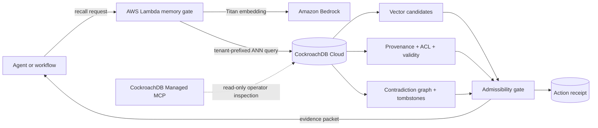

# Continuum

> Memory is evidence. Not truth.

Continuum is a persistent memory control plane for AI agents that need to earn trust. It stores not only what an agent remembers, but who asserted it, when it was valid, why it may be used, how confident it is, which memories contradict it, and whether it has been revoked.

Built for the CockroachDB × AWS **Build with Agentic Memory** hackathon.

## Why this exists

Most agent memory systems optimize one question: *what looks semantically similar?* That is not enough for an agent that deploys software, schedules care, moves money, or changes access. A stale policy can rank highly. Two incompatible claims can both look relevant. Deleted knowledge can silently return through an embedding cache.

Continuum treats recall as an admissibility decision:

1. Retrieve semantically similar candidates.
2. Enforce tenant, purpose, consent, status, and time-validity gates.
3. Surface provenance and contradiction edges.
4. Reduce answer confidence or require a human when evidence is disputed.
5. Persist an immutable action receipt that explains what the agent used.

## Award demo

Open the live interactive product and run the deployment case:

1. Run the memory trial for `payments-v3`.
2. Inject a contradiction into an old Friday deploy-freeze memory.
3. Watch Continuum quarantine the disputed memory and reduce decision confidence.
4. Inspect provenance, validity, consent, and conflicts.
5. Challenge or revoke a memory, then simulate regional loss.

The hosted interface is a deterministic interactive demo so judges can reproduce the entire safety story without credentials. The repository also includes the cloud adapter, SQL schema, policies, and deployment contract for a live CockroachDB Cloud + AWS Lambda implementation.

## Architecture



### Sponsor technology

- **CockroachDB Distributed Vector Indexing:** `VECTOR(1024)` embeddings with a tenant prefix and cosine operator class.
- **CockroachDB Cloud Managed MCP:** least-privilege, read-only inspection of live schemas, audit receipts, conflict edges, and regional health.
- **CockroachDB multi-region persistence:** memory records and receipts are modeled for regional survival and transactional consistency.
- **AWS Lambda:** stateless recall/admissibility endpoint.
- **Amazon Bedrock:** Titan Text Embeddings V2 for semantic retrieval; a reasoning model can consume the returned evidence packet.

## Repository map

```text
app/                         Interactive product / judge demo
infra/schema.sql             CockroachDB schema and vector index
infra/lambda/handler.mjs     AWS Lambda recall + policy gate
infra/lambda/package.json    Lambda dependencies
infra/mcp/README.md          Managed MCP operating procedure
docs/ARCHITECTURE.md         Data flow and failure behavior
docs/THREAT_MODEL.md         Abuse cases and controls
submission/                  Devpost copy, demo script, checklist
tests/                       Product and memory-contract tests
```

## Run locally

Requires Node.js 22.13+.

```bash
npm run install:ci
npm run dev
```

Production verification:

```bash
npm run lint
npm test
```

## Connect the real cloud path

1. Create a CockroachDB Cloud cluster and database.
2. Apply `infra/schema.sql` with a schema-owner role.
3. Copy `.env.example` to your secret manager; never commit credentials.
4. Package `infra/lambda` and deploy it to AWS Lambda with network access to CockroachDB Cloud.
5. Grant Bedrock `InvokeModel` only for the configured embedding model.
6. Configure CockroachDB Managed MCP with read-only scope for operator inspection.
7. Set `CONTINUUM_DEMO_MODE=false` and run the smoke tests in `infra/lambda/README.md`.

## Honest implementation boundary

The public judge experience currently runs deterministic demo data. The CockroachDB schema and Lambda adapter are production-shaped and testable, but become a live end-to-end cloud deployment only after the repository owner supplies CockroachDB Cloud and AWS accounts, secrets, and billing consent. The UI never claims its simulated region-loss control actually changes cloud infrastructure.

## Security

- No database or AWS secrets are stored in the repository.
- Recall is tenant-prefixed and purpose-bound before semantic ranking is accepted.
- Revocation removes content/embedding and preserves only a non-sensitive tombstone.
- Managed MCP is configured read-only for inspection; mutations use the application role.
- High-impact disputed evidence returns `human_review_required: true`.

See [docs/THREAT_MODEL.md](docs/THREAT_MODEL.md) for the full model.

## License

MIT
