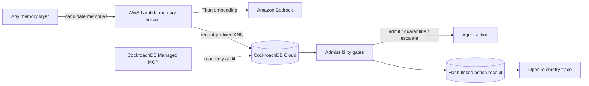

<div align="center">

# Continuum

### The memory firewall between AI agents and irreversible actions.

[Live product](https://continuum-memory.wangshiyue1128.chatgpt.site) · [Run the Memory Gauntlet](#reproducible-evidence) · [Architecture](docs/ARCHITECTURE.md) · [Threat model](docs/THREAT_MODEL.md)


</div>

> **Memory is evidence. Not truth.**

Continuum is a vendor-neutral admission-control layer for agent memory. It sits between any memory system and a high-impact action, then decides whether each recalled fact has earned the right to influence that action **now**.

It does not try to out-remember Mem0, Hindsight, or Graphiti. It makes their output governable: provenance, validity, tenant, purpose, consent, contradiction, revocation, and confidence are evaluated before recall becomes action.

## The market gap

Production memory projects increasingly optimize recall accuracy, learning, temporal reasoning, and personalization. Those are necessary, but a deployment, payment, access change, or regulated recommendation needs a different question:

> Can the system prove why this memory was admissible for this actor, purpose, and moment—and show what happened when evidence conflicted?

Continuum's buyer is the AI platform, security, or governance team operating autonomous agents. Their pain is not “the chatbot forgot my favorite color.” It is:

- a stale policy influencing a production action;
- poisoned memory persisting across sessions;
- one tenant's fact leaking into another tenant's recall;
- personal context reused for a purpose the user never allowed;
- an incident team unable to reconstruct which memories caused the action;
- a delete request that removes text but leaves the embedding recallable.

## The product in one trial

The live product asks whether an agent should deploy `payments-v3`.

1. Four memories are offered as evidence.
2. An old Friday freeze initially looks relevant.
3. A newer release calendar contradicts it.
4. Continuum quarantines the old record and lowers decision confidence.
5. In **Shadow** mode it records `WOULD BLOCK` without disrupting production.
6. In **Enforce** mode it returns `HOLD — HUMAN REVIEW`.
7. The action receipt links the exact admitted/rejected IDs, policy version, OpenTelemetry trace, evidence digest, and receipt hash.

## Reproducible evidence

```bash
npm ci
npm run eval
npm run bench
```

The credential-free **Memory Gauntlet v2** contains 72 generated-and-checked-in cases: 12 safe controls and 60 unsafe recalls across 12 attack families.

| Attack or control | Expected result |
|---|---|
| 12 current, correctly scoped controls | Admit |
| Expired policy | Block |
| Explicit contradiction | Block |
| Revoked or disputed memory | Block |
| Cross-tenant leakage | Block |
| Wrong subject | Block |
| Purpose drift | Block |
| Consent mismatch | Block |
| Memory prompt injection | Block |
| Low similarity or confidence | Block |
| Compound attacks | Block |

Current checked-in result: **Continuum 72/72; naive vector-similarity threshold 17/72.** Continuum detects 100% of the suite's unsafe recalls with no false positives; the naive threshold detects 8.3%.

The checked-in reference local Node 24/x64 run evaluates 72,000 candidates with policy latency of **0.791 μs p50, 1.081 μs p95, and 1.883 μs p99**. It also verifies a 1,000-receipt hash chain and detects a mutation at receipt 513. These measurements vary by machine and exclude network, Bedrock, CockroachDB, and third-party retrieval latency; rerun `npm run bench` for the authoritative result on your hardware.

This is an executable admission-policy benchmark, not a claim of state-of-the-art conversational recall or superiority over a third-party memory product. The generated corpus, checked-in labels, SHA-256 digest, confusion matrices, benchmark, and CI assertion are public in [`evals/`](evals/).

## Real adapters, fail-closed metadata

[`infra/adapters/`](infra/adapters/) contains vendor-neutral `continuum-candidate/1.0` adapters for Mem0 search results and Graphiti edges. Missing tenant, subject, purpose, consent, lifecycle status, confidence, or similarity is never invented; the candidate is rejected until the upstream memory includes sufficient governance metadata.

## Why it is differentiated

| Project | Primary public positioning | Continuum's relationship |
|---|---|---|
| [Mem0](https://github.com/mem0ai/mem0) | Personalized, efficient long-term memory | Continuum governs candidate memories before high-impact use |
| [Hindsight](https://github.com/vectorize-io/hindsight) | Memory that learns and reflects | Continuum constrains learned memory at the action boundary |
| [Graphiti](https://github.com/getzep/graphiti) | Temporal context graph and provenance | Continuum turns temporal/context evidence into an admission verdict and receipt |
| [agentmemory](https://github.com/rohitg00/agentmemory) | Cross-agent memory for coding tools | Continuum adds enterprise policy, tenant isolation, and action accountability |

The moat is not vector storage. It is the **policy-and-receipt protocol** around memory use.

## Adoption without a rip-and-replace migration

1. **Instrument:** send existing memory candidates to one decision endpoint.
2. **Shadow:** record admit/block/escalate decisions without blocking agents.
3. **Calibrate:** review false positives, policy coverage, and unsafe-recall classes.
4. **Enforce selectively:** fail closed only on irreversible or regulated actions.
5. **Prove:** export trace-linked, tamper-evident receipts to the existing observability stack.

## Architecture



### Sponsor technology

- **CockroachDB Distributed Vector Indexing:** `VECTOR(1024)`, cosine search, exact tenant prefix.
- **CockroachDB Cloud Managed MCP:** least-privilege, read-only inspection of schemas, conflict edges, receipts, and regional health.
- **CockroachDB transactions and multi-region model:** memories, contradictions, revocations, and evidence receipts share one ledger.
- **AWS Lambda:** stateless shadow/enforce admission endpoint.
- **Amazon Bedrock:** Titan Text Embeddings V2 for semantic candidate retrieval.

## Quick start

Requires Node.js 22.13+.

```bash
npm ci
npm run dev
```

Quality gates:

```bash
npm run lint
npm test
npm run eval
npm run bench
```

Cloud setup is documented in [`infra/cloud/README.md`](infra/cloud/README.md). `npm run cloud:doctor` checks the local AWS/SAM prerequisites without printing credentials. `npm run cloud:proof` refuses deterministic demo output and writes evidence only after a real AWS Lambda request commits a CockroachDB receipt.

## Repository map

```text
app/                         Interactive product / judge demo
evals/                       Memory Gauntlet scenarios and runner
infra/schema.sql             CockroachDB vector + evidence ledger
infra/lambda/                AWS Lambda firewall and policy engine
infra/aws/                   AWS SAM deployment
infra/adapters/              Mem0 + Graphiti normalization contracts
infra/cloud/                 Real-cloud doctor and proof capture
infra/mcp/                   Managed MCP operating procedure
evidence/                    Redacted cloud-proof schema
research/                    Design-partner protocol and evidence ledger
docs/                        Architecture, API, observability, threat model
submission/                  Devpost copy, demo script, checklist
tests/                       Product, policy, and artifact tests
```

## Honest implementation boundary

The public judge experience uses deterministic demo data so every reviewer can reproduce the contradiction flow without credentials. The policy engine, evaluation suite, CockroachDB schema, and Lambda adapter are executable and production-shaped. They become a live end-to-end cloud system only after the owner connects real CockroachDB Cloud and AWS accounts.

`evidence/cloud-proof.example.json` is explicitly not proof. A real claim is made only when the non-demo capture script produces `evidence/cloud-proof.json`. Design-partner evidence also remains at 0/3 until real practitioners consent to anonymous, role-level reporting of an objection and the product change it caused.

The region-loss button is a product simulation; it does not claim to mutate live infrastructure.

## Security

See [`SECURITY.md`](SECURITY.md) and [`docs/THREAT_MODEL.md`](docs/THREAT_MODEL.md). Do not report real credentials in a public issue.

## License

MIT © 2026 Shiyue Wang
